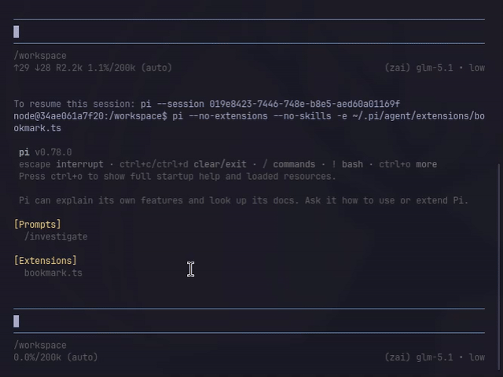
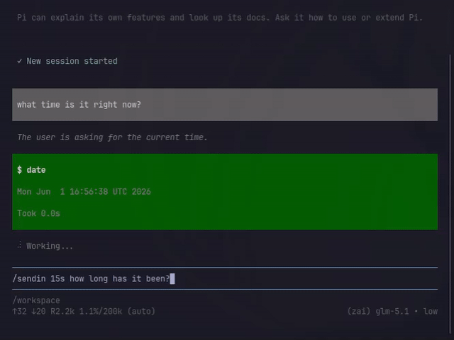

# agent-stuff

Stuff I use with my agents. 

## Extensions

### bookmark

Save a position in any session tree and jump back to it later. Bookmarks are global. You can save a position in any session and jump to it from anywhere, regardless of which session or working directory you're currently in.

- `/bookmark set <tag>` — bookmark the current leaf entry
- `/bookmark browse` — fuzzy-search TUI to find and jump to a bookmark
- `/bookmark list` — print all bookmarks as text
- `/bookmark remove <tag>` — delete one

Persists across sessions in `~/.pi/agent/bookmarks.json`.



### sendin

Send a user message after a delay.

- `/sendin 10s "hello"` — fires after 10 seconds (supports time units like `s`, `m`, `h`)
- `Alt+Up` — cancel and restore to editor
- `Alt+Right` — send immediately
- `/sendin list` / `/sendin cancel` — manage pending messages

Live countdown in the footer. Multiple messages can be pending at once.



### impersonate

Inject text into the conversation as if the assistant said it. The model cannot distinguish injected messages from its own output. Useful for steering.


## Prompts

### investigate

Strict audit-mode investigation. Forces evidence-first reasoning: decompose claims, search the repo, trace call paths, attempt to disprove conclusions, write a structured log to `investigations/`, then report back with a claim-status breakdown (PROVEN / DISPROVEN / UNRESOLVED) and evidence map.

Invoked with `/investigate <question>`. Useful verify what codebases actually do versus what they claim or to understand implementation details. I found that git cloning a repo and querying it with /investigate to be a decent replacement for DeepWiki.

## Skills

### strong-inference

Debugging methodology based on [Strong Inference](https://en.wikipedia.org/wiki/Strong_inference): devise multiple hypotheses, design decisive experiments that falsify at least one, run them, repeat.

### tmux

Run interactive programs (Python, vllm, training scripts, gdb, ...) in a tmux session and control them from the agent: send keystrokes, capture output, wait for patterns. Uses a private socket so sessions are isolated.

My go-to tool anytime something needs to run in the background while the agent keeps working. Covers 90% of cases where I'd otherwise use a sub-agent.

### quote-search

Search local files for quotes and passages about a topic using ripgrep. Teaches the agent to think in themes rather than keywords — regex alternations, broad-to-narrow iteration, thematic result grouping.

### fasthtml + fastlite

Two related skills: [FastHTML](https://fastht.ml) for web apps (Starlette + HTMX + FT tags) and [fastlite](https://answerdotai.github.io/fastlite/) / sqlite-utils for SQLite CRUD. They cover routing, FT rendering, typed dataclass models, auto-migration, and common patterns.

Useful for writing simple python based web application when you don't want to bother with building html/react frontend.

Skills were auto-generated from `https://www.fastht.ml/docs/llms.txt` and `https://fastlite.answer.ai/llms.txt` using the excellent [SkillGen tool](https://github.com/mihir-s-05/skillgen)

## Directory layout

```
extensions/    Pi extensions
prompts/       Prompt templates
skills/        Skills
```
